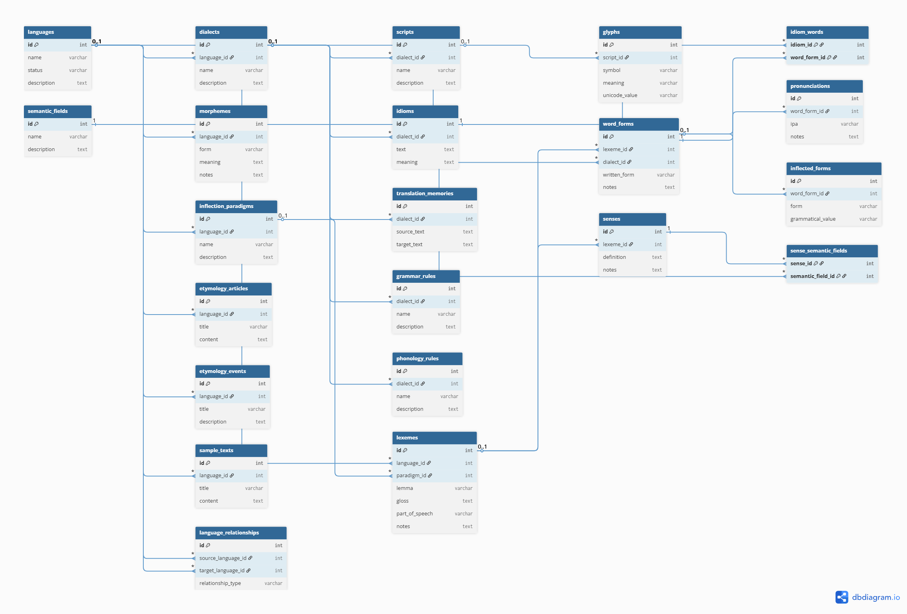

# Conlang Library

## Database ERD

## Database Philosophy

- Languages contain Lexemes, Morphemes, Paradigms, and historical records.
- Dialects contain Scripts, Grammar Rules, Phonology Rules, and Word Forms.
- Word Forms bridge Lexemes and Dialects.